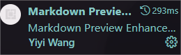

[TOC]

# 自制Markdown教程[^1]

## Markdown介绍

### Markdown是一种轻量级的<u>标记语言</u>

可用于在纯文本文档中添加格式化元素，使之产生美观大方的排版。其相较于 Word 是一款**所见非所得**的文本编辑器。

1. Markdown 是**纯文本可移植**的。几乎可以使用任何应用程序打开包含 Markdown 格式的文本文件。如果你不喜欢当前使用的 Markdown 应用程序了，则可以将 Markdown 文件导入另一个 Markdown 应用程序中。这与 Microsoft Word 等文字处理应用程序形成了鲜明的对比，Microsoft Word 将你的内容锁定在专有文件格式中。
2. Markdown 是**独立于平台**的。你可以在运行任何操作系统的任何设备上创建 Markdown 格式的文本。

### Markdown的工作原理

在使用 Markdown 格式书写时，文本内容存储在拓展名为 `.md` 或 `.markdown` 的纯文本文件中。然后通过 *Markdown 解析器* 将获取到的 Markdown 格式的文本输出为 HTML 格式。此时，就可以在 Web 浏览器中查看你的文档，或者将其与样式表组合并打印。你可以在下图看到此过程的直观表示。

![The Markdown Process](data:image/png;base64,iVBORw0KGgoAAAANSUhEUgAAAbAAAAIYCAMAAAA7N0kGAAADAFBMVEX///8AAAC/v78/Pz+IiIi1tbXt7e1/f39aWlra2tp2dnbIyMjq6uoiIiKbm5v39/cuLi7u7u4mJiZubm59fX2ysrKZmZn6+vocHBzy8vL8/PxVVVWUlJTv7++AgID4+Pitra3+/v6EhITb29tAQEAVFRUqKipiYmKmpqZFRUXo6OhYWFifn5+vr6+MjIzBwcHi4uKOjo7g4ODFxcXKysqhoaHW1tbx8fGHh4fn5+f09PTe3t5cXFzd3d3S0tKqqqqRkZE6OjrY2NikpKRQUFA2NjbOzs7U1NT29vbl5eXLy8uYmJhLS0tlZWW8vLy5ubnExMTz8/N+fn5qamq7u7sNDQ2pqamrq6vQ0NAzMzNmZmZMTExycnLMzMy3t7e6urrDw8OCgoKKiop5eXnp2beMg4iMjIiIiIyMl6vL5PDp06x/fpbU7O7u5s6TjHVmZm6NoLvl7u7p6e7jxY5mZmpzZmZmZYLE5fDu5L9+ZmZvgZShoZmFamZndKLh7u7kyJOXxOnLq4aWwuXtzJKtg2KOsNDu7uWkhGaLstjJ6u7t6r9tZmZmZnWatdLu7MyPe3uRnZ1qcY7u7tupi3Vma4PVxJu3z+d+cYqhoY7s7dShimzu4rdsjb3l7umJpdDXtIZ0h6fi1arI4cqQmZTZ7O7u7unu6eXl4duyl3ao0etndpK7x8etlXOQuuHEtZVxlciVrcG6po6ZdWS82vDF2uGYbmSmw8fCr5DkxJPClWlmaZvk7uVtk8fi69bj5r+eus5ngrLGmmrI4et9oNC6jWRmbp7QpX3E5eScxOnoyJOcxOTJ4r9mZYrV7uXozJLd3dS94PDEnHfl6r/cxI6gyOrozZe9vo+feGTu6enLu6y3xt/p7u7u6d+7rq7I3e200+vez7mutcnu6sNnfqzr0Z/F6e7I6eWJpMV1nNBma43l2cGlxdprh6fD0Njh5eFrh7Zvi7JrambgyJyDhGzu5eHh5end4enl3d3l6e7d4eXY1NDU2OHl6enu5d3Y2N2Tf4j9SEkWAAAQfElEQVR4AezdhXbqWBSA4b2RWgjpCRV6SAU5qbsb7uM+7/8kw3XpknHCuv+Pw/KPuAn9hYiIiIiIiIj03yslBNiLAJN/p/QHMAKMAAMsk81m54QAo+mDEWCAAQYYAQYYYIARYIABBhgBRvrfNy8EGKPE/6p5wD4EGGCAAbaQzWYXZfYDjAADDDDACDDAltQTkZyflw8Fy+bdu9AAliywgq6IyKquyYc+MK0Dljyw4obYkkayWVDdWt9eWNKd0JQrJVutacEZ8WLdzaUKtry0Jxv7B4dH6o4BmxrY7kntVM786Ly8X7q41Ksg9q9v4ts7d/8QVx6fnFnU/MVT+OzMrSvZq/Ah9utrzgA2NbCjRkGOmscn1svZXGsC5kkQF/Re2u5BjDOdblke3FWvP9DisNIM4itZD6cHBlh+VDS19s6J1GNVHQf+owTLqgNZTFsJQrN3IhPBcearKF+7ag2CcCQBYFMEi8qtim/3TgI/2pSvx68wAv/5LrTt4lCCoul8IxL4475z1ab6w1e/AzZVMOno5HHy4H8r3+nOG5DbWz9v3PV65Exfvw+i4g8PcXH7Un8UwKYMVojkQtuydyKRavenH9+B/PzLWV9VnZFfVV1fZGm3nHOXgCVoTcfDg3yavZVXrf/Achirpgiwfz/ACDDAftNXeTex3b0CbBbA/Ha12t649aQE2CyANbryqrMVOwHL7WpvAFiyhzD3cyrlSXt5AmZbP50d/ZIDLPHTsJJdfAW2qDe3m71VwBI9SkxbmfQW7FURYIkGq30Aaztj5feLGQBjCGu/Arv1T9Y9PU00GNOw7huwtD28krpTjcozBMaajtttEcBYNUWAAQYYYAQYYIABRoABBhhgBBhggAFGsw9GgAEGGGAEGGCAAUaAAQYY560H7EsHo+xfaGEh+1cDDLBEBBgBRltcmQMwAowAA4wAI8AAI8AIMMAIMAIMMAKMAAOMACPAACPACDDACDACDDACjAAD7A927ADDYSCM4vgSzAmy5AylhyjQTOYAL8n9z7HAdmGR8f/6mXoPLDSYn2bnX89g/6/q6qblK2qi93lgy6TLK3lgBitqFz/xlJ5xYPzjRgPjT79ozwIz2K7S8xZdc8AMtnbdIKr2HDCD7ao9F5VNcwaYwWZtS9/njgwwgx2935Sb6vvBDFZ1Y/738Sf8jUz6/XMsMP6213QPBRO9TwC7q/H9hoFVcsOB8WdedMaC8c8dHexU4d+nBstvZr6eDcY3M1/PBuObma9ng/HN3L8NrGeD8c3M17PBgDseWs8AWBO8NQGMbeb+PYB6NhjQzGA9A2DoCbcxwU4VBv71ZjVYbDMjX7BXPRssvpmpy8tssPhmnhbuWYfB0pqZr2eDAava4n9DNhjfzNCaqsEiV/82M1/PBuOb+cE+sagYDBhwvGA9G4xvZr6eDcY38w8758HVuBFF4fvoxeNxoUVydq3EagejUEQcOljgIpaOQu///z/EnmgrzT47W7TWBfdT9am8e98b8S09AWCOrvBRJzMIZc20VsZ0xcC+jbq+LMIXU3QNIEsVfJTnIFTekeieY2ASPDM3aFJBmpGPQZuCf3Fjbm4UHZQzt1qO7EIOi3cUTKHHQ2ljFX/v9I5kaef3R+7Zi4F9C3mPPDM3rIkEro923EVy6paePiHH85J1ymFNH95tvGQ3qtd0PdWtVCiJ+5ETSq4aOWnuuXc6BtaWZ+asMpnHu7lzt9Q1Pl7V02vdCvI2G4GmFoF1h7MqUCzU9cUiDSgbfvN3y5Hmnr2JLWc6Bta6Z27wuN5M6LVlF6NEpKetLHBClFWguoDl8EwJOOlWCnPqaGZ14jdrBPAcie55+FIwi4HN7rbimTmrpIOHLCbdQdpb5BOlJgxraJauoXpA0VlkZWCtoIwV2EHByApYniPX3oXMOhxYwg7Oj1/dqJz5mknDUN1yMK38QYMhkKKe3mb1aZbT7KPSCrNQJhPrdP0csLoYlvhaZh1+Skxv27pg9oJn5ikfvewAk+7bZaLL1LXlAI3H+MahkiWiJBJbRIcKeMrCsJ5A+PtT7vnNk3Ke/nr90Tc7GxMG6/RrWF+D2c5xi33mEsfnWuTh960VNOZh/xO6739SM4++iYEJaX3iOHvsmeVbhosOPSUW3sjW0AULloVnliop7jn6RQf6pUsAe7Q95acoXkeW9bKVHrP1ne9ySnz3XYyzqHi4cWpSU/rCh/Sap/zoAxOF4o0mp5cvIbKXEE15Ahjzp/+s6PnZculDes1ZxIGFx5amyW+FyZ88aANYDsC44TefKp+m11EHlhDHVvtpRBeton0J4/xdgOXtYjKZI18cZp+m11EHNiuOrbbHOTSThuRPHkgEdqLvqKYaAvs0vY4iMAm9/OkJN0gA/4wYVNTeDvSQvi9/dErOKTEEFqbX0QAmfyRxewf2PHAUDLu0yw22YgUL329av9WiY5GFwD5JrxvvogZMQhoxnvoLUxkFZg4oZsU2sPPfb/y3jSrx45Pyf3rNjflqpTL9SwHDq7dqqFBTvmiGnaQWM2ng3JHtmR+rfR/mi+D60/Sab1FDzq8ErAX3nL2cXple3tFMC/B2OCsDqtXCLSQgQXHS0f4kfJpOAbjBQnZjYYmNcmNosYuW4jE3SZI/SDqaGRdNsnlzk6hf4YZKlJfumWNg8g2TWlE4wDOlmhKPasuX/MUQ9hwaWqS+eDFEFNwzUE6Ll9PxeLlRFNyzxBXuMTAJh9jFf+ydQa6bMBBAR3hhLgDSbLpOhcQh+Cvj+AAP+Pe/Rrf9VSPHv52IoHlHmKfYekEM/srsVeq5nZ0sLuyd1j7cxYVZU3yxyvvVs9lzZhfmy8FcWILF1++9EzObwYoOF3byet6YxYW9hkxv0Mwu7NT1vFusQV9c2MNVDWrfzK1MhM6F2dSzWrwOoweMLszoYzlFDMhwqAuz+hyVAWtg71yY1QffDEgTbC6sUs/2thv4CLiw2qlm38wN6OzCmurZvplruLD/W889WVzYSeu53swGQPyXCafbGLedfovjoBVhl6vnejMbMAR6/eaE9dbzO8egFWFXr+fMJNYsd8LynQmvB0DJuVvXtcvzBHAsFxEmhXieZv6CFrg1TzgdQPlyDKaPCYhaEXbheo6UF3Ui+9o0YR2BnORPUoQwXkKYRDZ7x9+ku0PLr3kNEJP8jaXAvlxBmAaaifIqcuD5Cd+grI9t3gnDBYRJppWg8jL057MT1gi5cpgwWwtznp1w6gldNR/BhRlT6J68vqZFaizBhVlzEIanrq9DpY5OLsyaCHPD9VVBowuzZoBNG66vCiqOMUtgH+Qht/r15bwWnWB7cJStOxwq58IZHvyHsWxw7+R0OJqB/qZfH3r1ELKcEidFgGMcPpPI8jmMPUBUOSuODoUHTybPiPMjSvqIZQIoZf7FTh3bNBgEQRjdjS4mPunCv411Ee6/FkCWYwgsxFjvtfBpRq2AYAiGYAgmGIIhmGAIhmA5BBMMwRBMMARDMMEQDMEEQzAEEwzBEEwwBEMwbrf6FSwMwQRDMAQTDMEQTDAEQzDBEAzBmP0MtqcI0M9gXSTY8wg2u0j5xLM8Yo5+BOsi5hPP8ohRn3iWRwzS38G6SLHnLI8YZPZZHjFJn9VFjv2lyDHXNRWE7voD91fhuu6vkBWMn4N9/CMIJhiCIZhgCIZggr0dwRDsk32yaHbcCqJwUPuuWeufhFch7VO9HXxo0jUzW9IwMz1mZmZmZsYwc0Uy3YArq3D0mc+RbKu/6lOnz7zwwtlzaZCC9IxMFuD3mqxsRI1WRws9UGiiCvvDYA3InzhB0GhK1fE0TdUwZgtabXZ0OCGOS0PPoIkq7A/EhW4WWA96U3Q+OuzUjZ8LAARDGGaSeYQFCk3+MFRhnBuAFUQve8qO0nnmwsVLdrycBleucteyJRNcJ3j5Bpt+85bovX0HNed0yQbgrngPZC5YHPevPgB4+OgxwWtPLj4l+CgnlyZp8Eeiblg47638Aiw0k6LiEiw1E05bhuW5fr6iEiWTAR+9XaWpdiGeq6mV6ur5e4kGABrQzYBMY1NzbYvy0lrCV7QRbC/DjiBNnPBHogpT4B3QKXXBlVqHQLoBenrbxFKAPqm/yuHMNZNuFzeQO8gNATQah2ONKXpuISh0jowqejqbdGOaiEDCwDzU9NME/lBUYYH8l8fvaCYmOZRxTIluVh70NM4wMKvpr0KFcpfGFFcrzcWa2IZ5QSY439sc1yMfJyhfMMv300QV9kci7w4ADKK30Zi5kLu4JIheZdCP0Q3sQ6m/tmNZv7K6pozdgOu5yxub6bFG0bBFtpcBYAdbgrXlAI2Knl2BuAEeSns0gT8UdcO80ZkPGHB/+ToexIW12g/XjiySqZE/Dk7ijCLMTN7POWVx3I43INPHWT/48LpoTMudP6y5jr06A38skMOuDfs20EQV9kcyiwPRXflouQ8RP9ZtKQvS2atLJ4ifSJErdxC5AMwqgj4VEQ8jEG8AgGE9KFOUBky6iPxnvToz4YflGo3VP0tMqrA/h89f/gIowTe+BIWvXv46Gb38DW2isMFv3/sOFFZih+V+L4hDP/z4i0TdsH8yrFn0/sS+HVgAAIBQFNwfWrFRaoYgxb0VDhHfL/FTUQlMwAQMmIBpAnYqAbNekRumBTABEzBgAtbs3AGH5DAUwPGqZWmPipqQAe4bDG4pRMZBtQAezmMk3/9T3MttFnXzanPa7lXeH4q3xfqZSNoxLeTW8veetPZMYFDlBvy9Jw0ErBywENRKflR848Vd7NocBGxzMI/oFZvGnhXzDcZeZuXfnnv1qHcD6272ZgoEIy8cFBsiK6bxI40D40WzfcDMA2IPUxqYXxFZn78hNn5Ss0NqYLwovQeYqQHCHABqUwAY75EhZhFfJxVzEYzzovT2YNcagopuAeprAWCMRpaYRrRpTg2sF6U3B7tB3X3I2YLAPFLNy3vaqkXjPQ36p2IN3tWf3EA53ovSW4O18DNNbhDKAQu4yKlF98Wwt2rZ8u85r5TeGAxApQnzD+clYFOPy/xeYAaguCVxeO/vJTEN1pdELqRe6W6k3PZLok2TKWtJlE3HOthM113ALNTXf910yLZ+7P3RYOTUGrp2LcC36tPJwRkmZV2PaA8FSwfn9tcDqPyjszyaOvoTRpkZYm39eTF5+BsajA2zOhyMMtZaU5lMMXm94q162sU5F0eOGvcAS0WxUJ0neYFp6hOBCRjV2a46UQK2TMAETMC+5yZgX9oPyEu+l/j1SQWACZgkYJKACdieSfIrAgJW/UdJ8Ls9OigAAIQBIGT/1HbwNXdQAWHCEIYwYQhDmDCEIUwYwhAmDGEIE4YwhA0jDGHCEIYwYQhDmDCEIUwYwhAmDGEIExYhDGEIE4YwhAlDGMKEIQxhwhCGMGEIQ5gwhCEsQZgwhCFMGMIQJgxhCBOGMIQJQxjChCEMYQnChCEMYcIQhjBhCEOYMIQhTBjCECYMYQhLECYMYQgThjCECUMYwoQhDGHCEIYwYQhDWIIwYQhDmDCEIUwYwhAmDGEIE4YwhAlDGMIShAlDGMKEIQxhwhCGMGEIQ5gwhCFMGMIQtp8wYQhDmDCEIUwYwhAmDGEIE4YwhAljFmGfOQAAAAAAALy7b4vGSWvDRP4AAAAASUVORK5CYII=)

至于*Markdown解释器*的实现这里给出一个网站[MarkDown文本解析器](https://blog.csdn.net/Mmonster23/article/details/108600170?ops_request_misc=%7B%22request%5Fid%22%3A%22169494956316800215099134%22%2C%22scm%22%3A%2220140713.130102334..%22%7D&request_id=169494956316800215099134&biz_id=0&utm_medium=distribute.pc_search_result.none-task-blog-2~blog~baidu_landing_v2~default-2-108600170-null-null.268^v1^koosearch&utm_term=markdown解释器&spm=1018.2226.3001.4450)（我pull下来了，但还没有run起来，~~以后有机会再搞~~

### Markdown编辑器

在线编辑器如*[在线markdown编辑器](https://markdown.com.cn/editor/)*，本地的有**[Notepad+](https://notepad-plus-plus.org)*、*Vscode*(万能)、*Typora*(Markdown专用编辑器，好用但收费)等

下面介绍如何用Vscode写Markdown:需要下载以下插件
1. *Markdown All in One*  ——使Vscode支持基本所有Markdown语法（支持 `Mermaid` ）,并提供自动代码补全,快捷键功能
    
2. *Markdown Preview Ehanced*   ——用于渲染当前编写文档的效果同步预览 
    
3. *Markdown PDF* ——将`.md`文件导出为PDF
    
4. *Paste Image*   ——用于快速引用图片至Markdown文档
    

-----------------------------------------

## Markdown基础语法

###  标题(`#`)

要创建标题，请在单词或短语前面添加井号 (`#`) 。`#` 的数量代表标题的级别。共六级

```Markdown
# Heading level 1
## Heading level 2
### Heading level 3
```
> **注意**：请用一个空格在 `#` 和标题之间进行分隔。

### 段落与换行( `<br>`)

要创建段落，请使用空白行将一行或多行文本进行分隔。要换	行，在一行的末尾添加两个或多个空格，然后按回车键(也可用`<br>`)。

### 强调(`*`)

要*斜体* 、**加粗**、***加粗并斜体***，需要用`*`包裹内容

```markdown
*TEXT1* —— 斜体
**TEXT2** —— 加粗
***TEXT3*** —— 加粗并斜体
```

### 删除线(`~`)和下划线(`<u></u>`)

您可以用双波浪号`~~`包裹内容来给内容添加~~删除线~~。
您可以用html中的<u>来添加下划线</u>

```markdown
~~TEXT~~
<u>TEXT</u>
```

### 列表(`x. `、`-`/`+`)

列表分为**有序列表**和**无序列表**：要创建有序列表，请在每个列表项前添加数字并紧跟一个英文句点`.`。要创建无序列表，请在每个列表项前面添加破折号 `-`，或加号 `+` 。缩进一个或多个列表项可创建嵌套列表。

```markdown
有序列表
1. line1
	1. line1-1
    2. line1-2
2. line2
3. line3
无序列表
- line1
	- line1-1
	- line2-2
- line2
有序无序嵌套
1. line1
	- line1-1
	- line1-2
2. line2
```


### 任务列表(`- [ ] text`)

任务列表使您可以创建带有复选框的项目列表。在支持任务列表的Markdown应用程序中，复选框将显示在内容旁边。要创建任务列表，请在任务列表项之前添加破折号`-`和方括号`[ ]`，并在`[ ]`前面加上空格。要选择一个复选框，请在方括号`[x]`之间添加 x 。

```markdown
- [ ] one
- [x] two
```

> 注意在`-`、`[]`、text间添加空格


### 表格(`|----|---|`)

要添加表格，请使用三个或多个连字符（`---`）创建每列的标题，并使用管道（`|`）分隔每列。您可以选择在表的任一端添加管道。

您可以通过在标题行中的连字符的左侧，右侧或两侧添加冒号（`:`），将列中的文本对齐到左侧，右侧或中心。

```markdown
| Syntax      | Description | Test Text     |
| :---        |    :----:   |          ---: | //分别是左、居中、右对齐
| Header      | Title       | Here's this   |
| Paragraph   | Text        | And more      |
```


### 引用(`>`)

要创建块引用，请在段落前添加一个 `>` 符号。块引用可以包含多个段落。为段落之间的空白行添加一个 `>` 符号。块引用可以嵌套。在要嵌套的段落前添加一个 `>>` 符号。块引用可以包含其他 Markdown 格式的元素。但有时并非所有元素都可以使用，你需要进行实验以查看哪些元素有效。

```markdown
引用
> line
多个段落的引用
> para1
>
> para2
嵌套引用
> line1
>> line1-1
> line2
带有其它元素的引用
> - line1
> - line2
```

### 代码与代码块( \`)

要将单词或短语表示为代码，请将其包裹在反引号 (``) 中。如果你要表示为代码的单词或短语中包含一个或多个反引号，则可以通过将单词或短语包裹在双反引号(````)中。如果你引入的是代码块可以将代码包裹在三反引号当中(``````)从而可以提供代码高亮功能。

```markdown
`code` ——代码
``code `1` `` ——代码中存在`
```python
print("code")
```				——代码块并提供语法高亮
```

### 分割线(`-------`)

要创建分隔线，请在单独一行上使用三个或多个星号 (`***`)、破	折号 (`---`) 或下划线 (`___`) ，并且不能包含其他内容。
```markdown

***

---

_________________

```

> **注意**：为了兼容性，请在分隔线的前后均添加空白行

### 链接(`[name](url "title")`)

链接文本放在中括号内，链接地址放在后面的括号中，链接title(鼠标悬停是显示的内容)可选。

超链接Markdown语法代码：`[超链接显示名](超链接地址 "超链接title")`

对应的HTML代码：`<a href="超链接地址" title="超链接title">超链接显示名</a>`   

同时也可以给`name`增加Markdown样式

```
[Markdown语法](https://markdown.com.cn "最好的markdown教程") ——链接markdown语法表示
```

示例[Markdown语法](https://markdown.com.cn "最好的markdown教程")

> 不同的 Markdown 应用程序处理URL中间的空格方式不一样。为了兼容性，请尽量使用`%20`代替空格。

### 图片(``)

要添加图像，请使用感叹号 (`!`), 然后在方括号增加替代文本，图片链接放在圆括号里，括号里的链接后可以增加一个可选的图片标题文本。

插入图片Markdown语法代码：``。

对应的HTML代码：``

同时也支持图片和链接的嵌套

``` markdown
 —— 图片
 --用html代码可以调控大小
[](https://markdown.com.cn) ——图片链接 
```

[](https://markdown.com.cn)


### 脚注(`[^name]`)

脚注使您可以添加注释和参考，而不会使文档正文混乱。当您创建脚注时，带有脚注的上标数字会出现在您添加脚注参考的位置。读者可以单击链接以跳至页面底部的脚注内容。

要创建脚注参考，请在方括号（`[^1]`）内添加插入符号和标识符。标识符可以是数字或单词，但不能包含空格或制表符。标识符仅将脚注参考与脚注本身相关联-在输出中，脚注按顺序编号。

在括号内使用另一个插入符号和数字添加脚注，并用冒号和文本（`[^1]: My footnote.`）。您不必在文档末尾添加脚注。您可以将它们放在除列表，块引号和表之类的其他元素之外的任何位置。

```markdown
Here's a simple footnote,[^1] and here's a longer one.[^bignote]

[^1]: This is the first footnote.

[^bignote]: Here's one with multiple paragraphs and code.

    Indent paragraphs to include them in the footnote.

    `{ my code }`

    Add as many paragraphs as you like.
```

## Markdown拓展语法

### 内联html标签(直接使用)

对于 Markdown 涵盖范围之外的标签，都可以直接在文件里面用 HTML 本身。如需使用 HTML，不需要额外标注这是 HTML 或是 Markdown，只需 HTML 标签添加到 Markdown 文本中即可。

> 在 HTML 块级标签内不能使用 Markdown 语法。例如 `<p>italic and **bold**</p>` 将不起作用。

### 内联latex语法(`$code$`)

如果你生成优美的数学公式或其他更好看的内容，可以尝试使用latex的语法，可以将由与包裹的内容进行渲染并产生最终效果。***在markdown中使用LaTeX，内容都是写在一对"$"中。***

> 只有部分markdown解释器内置了latex渲染器

### 流程图(mermaid)

在markdown里你可以使用mermaid拓展工具来绘制流程图。你可以前往

[Markdown画图及Mermaid入门 - LYinMX - 博客园 (cnblogs.com)](https://www.cnblogs.com/LYinMX/p/13347646.html)学习语法

也可以前往官网[Mermaid | Diagramming and charting tool](https://mermaid.js.org/intro/)使用其live editor来帮助你

### 使用Emoji表情

有两种方法可以将表情符号添加到Markdown文件中：将表情符号复制并粘贴到Markdown格式的文本中，或者键入*emoji shortcodes*。

提供一个[表情符号网站](https://emojipedia.org/grinning-face/)

```
:joy:  ———表情短代码
```

:joy:

> 注意：您可以使用此[表情符号简码列表](https://gist.github.com/rxaviers/7360908)，但请记住，表情符号简码因应用程序而异。有关更多信息，请参阅Markdown应用程序的文档。


### 目录(`[toc](name)`)

在文章开头加上`[toc]`可以根据你的标题生成目录

```markdown
[toc] //生成一个目录
```
> 目录的生成本质是根据你的多级标题
> 然而有的解释器要求标题级数必须相邻

### 角标(`^`、`~`)

你可以用`^`包裹来使之成为上角标，用`~`使之成为下角标
```markdown
x^2^ ——上角标
H~2~ ——下角标
```


[^1]: 相关官方教程 https://markdown.com.cn
